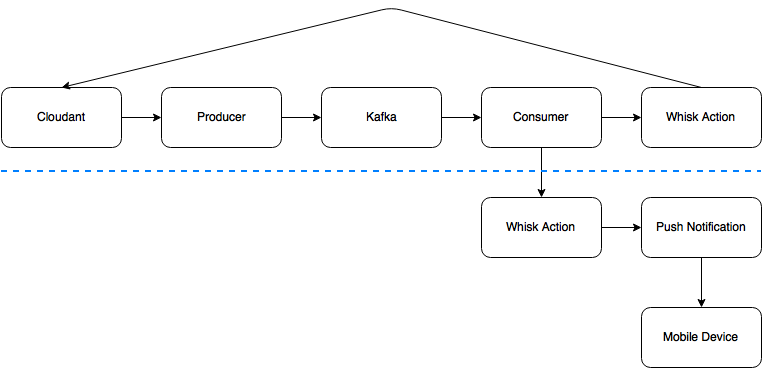

# cds-integration-sample

This project demonstrates the integration of Cloudant with Kafka and Whisk as depicted in the diagram below.  The entities below the dotted 
line are not yet implemented but the intergration concepts are 
apparent in the implemented portion of the flow.

# Setup

The integration sample depicted in this project was built using [Python 2.7](https://www.python.org/download/releases/2.7/) targeting a [Kafka](http://kafka.apache.org) server running locally.  This section details prerequisites and setup instructions in order for the 
integration sample flow to execute successfully,

## Prerequisites

- [Python 2.7](https://www.python.org/download/releases/2.7/)
- Preferably a clean Python virtual environment
- The [cloudant-python](https://pypi.python.org/pypi/cloudant/2.0.0b1) client library - Installed when setup.py is executed
- The [kafka-python](https://pypi.python.org/pypi/kafka-python/0.9.5) client library - Installed when setup.py is executed
- [Kafka](http://kafka.apache.org) and Zookeeper instances running locally

## Kafka Setup

Once Kafka and Zookeeper have been installed, perform the following in order to start the server instances and register a sample topic.  If running locally these steps will need to be performed after every reboot of your local machine.

1. Start **Zookeeper**:
  - From a terminal window cd to Kafka root directory (ex. /users/alfinkel/kafka/kafka_2.10-0.8.2.0)
  - Execute `bin/zookeeper-server-start.sh config/zookeeper.properties`
2. Start **Kafka**:
  - From a different terminal window cd to Kafka root directory (ex. /users/alfinkel/kafka/kafka_2.10-0.8.2.0)
  - Execute `bin/kafka-server-start.sh config/server.properties`
3. Create the Kafka topic
  - From a different terminal window cd to Kafka root directory (ex. /users/alfinkel/kafka/kafka_2.10-0.8.2.0)
  - Execute `bin/kafka-topics.sh --create --zookeeper localhost:2181 --replication-factor 1 --partitions 1 --topic sample-topic`
      - This will create a topic named _sample-topic_
      - You can verify that the topic exists by executing `list topics - bin/kafka-topics.sh --list --zookeeper localhost:2181`

## Whisk Setup

One way to configure Whisk is to use the [Whisk CLI](https://github.rtp.raleigh.ibm.com/whisk-development/whisk/blob/master/blue/docs/tutorial/WhiskCliTutorial.md).  This is the method that will be documented below.  After setting up Whisk, perform the following in order to register the appropriate action, trigger, and rule in Whisk.

1. Create the Whisk action _update\_jules_.
  - From a terminal window cd to the Whisk directory that contains the `update_jules.js` file.
  - Execute `wsk action create update_jules update_jules.js`.  You can verify that the action was indeed created by issuing the `wsk action list` command.
2. Create the Whisk trigger _updateJules_.
  - From the same terminal window execute `wsk trigger create updateJules`.  You can verify that the trigger was indeed created by issuing the `wsk trigger list` command.
3. Create the Whisk rule _updateJuleRule_ and associate the _updateJules_ trigger to the _update\_jules_ action.
  - From the same terminal window execute `wsk rule create updateJulesRule updateJules update_jules`.  You can verify that the rule was indeed created by issuing the `wsk rule list` command.

## Producer and Consumer

The producer and consumer are both implemented in [Python 2.7](https://www.python.org/download/releases/2.7/) using the [cloudant-python](https://pypi.python.org/pypi/cloudant/2.0.0b1) and [kafka-python](https://pypi.python.org/pypi/kafka-python/0.9.5) client libraries.

### Python Project Setup

From a terminal and preferably from a clean Python virtual environment, cd to the root of this Python project and execute `python setup.py install`.  This should load all of the necessary dependencies for this project into the virtual environment.  The project setup should only need to happen once.

### Configuration File Setup

TODO

### Running the Consumer

From a terminal, and from the the root of this Python project cd to /src/sample then execute `python process_changes.py`.  This will start a consumer that polls the Kafka server for messages sent to the topic _sample-topic_.

### Running the Producer

From a terminal, and from the the root of this Python project cd to /src/sample then execute `python produce_changes.py`.  This will start a producer that creates a Cloudant database and watches the changes feed of that database.  It also creates 10 documents which will in turn trigger the changes feed to produce output.  Upon receiving a change, this change is sent as a message to the _sample-topic_. 